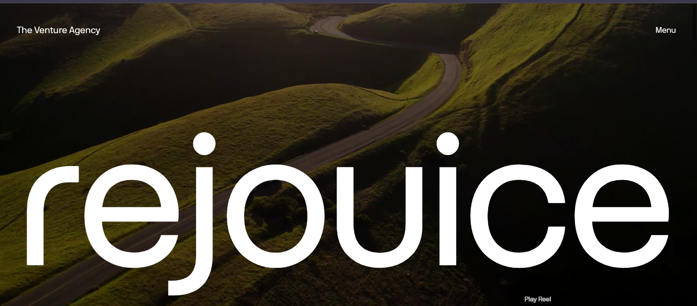

# Rejouice Landing Page Clone - Animated with GSAP

A responsive and animated clone of the Rejouice landing page created using **GSAP** for animations, **Locomotive Scroll** for smooth scrolling effects, and **Swiper** for the image slider. This project also includes custom cursor effects and interactive media components like autoplay videos.

## Demo

You can view the live demo of this project here: [Live Demo](https://walija7hassan.github.io/RejouiceClone/)

## Features

- **GSAP Animations**: Smooth animations for text and elements throughout the page.
- **Locomotive Scroll**: Smooth scroll effects for a seamless user experience.
- **Swiper.js**: Responsive image sliders with autoplay functionality.
- **Custom Cursor**: Custom interactive cursor with hover effects.
- **Responsive Design**: Fully responsive across different screen sizes.

## Technologies Used

- **HTML5**
- **CSS3**
- **JavaScript (ES6)**
- [GSAP](https://greensock.com/gsap) for animations.
- [Locomotive Scroll](https://locomotivemtl.github.io/locomotive-scroll) for smooth scrolling.
- [Swiper.js](https://swiperjs.com/) for the image carousel.
- [Remix Icon](https://remixicon.com/) for icons.

